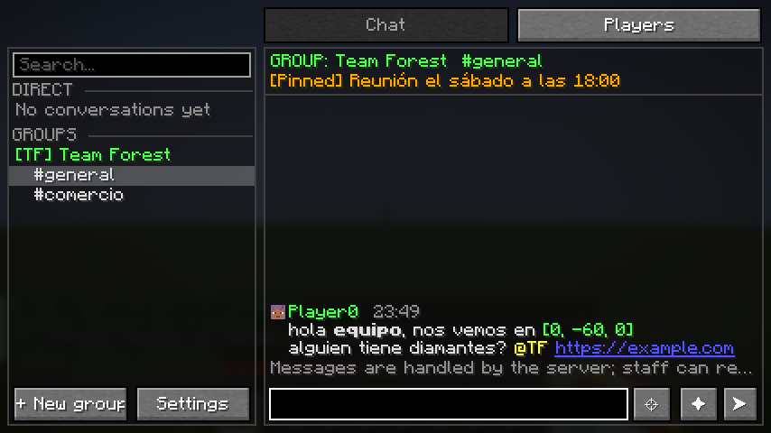
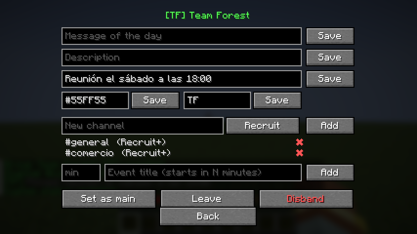
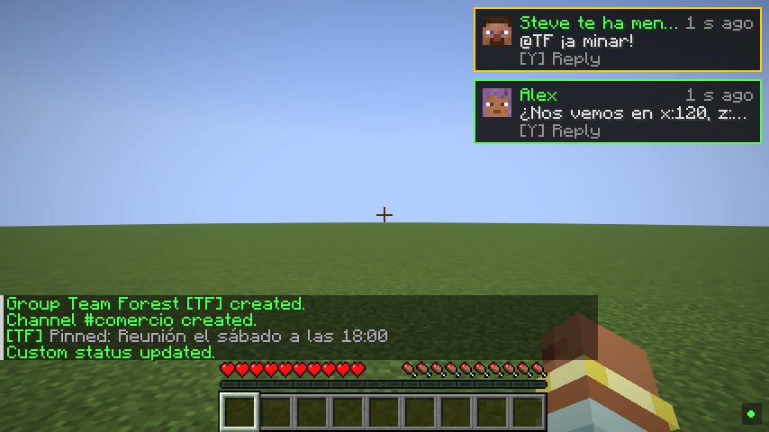
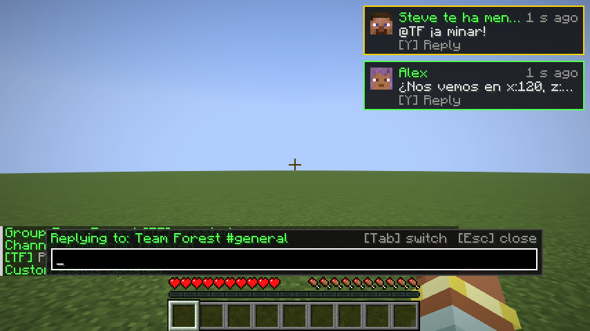
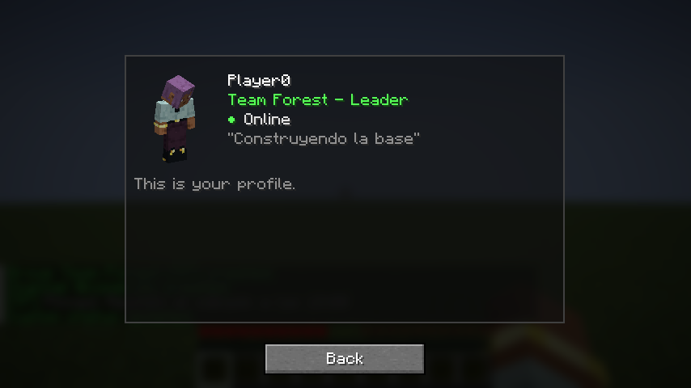
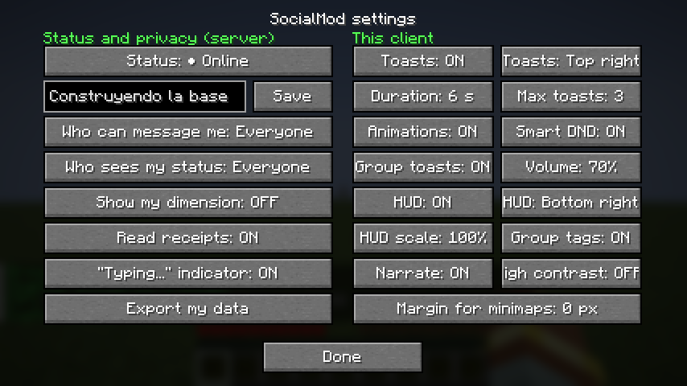

# SocialMod

### La capa social de tu servidor de Minecraft

**Mensajes privados · Amigos · Clanes con canales · Parties · Notificaciones · Respuesta rápida · Moderación**

Minecraft **26.1.x · 26.2.x · 26.3.x** · Fabric · Java 25 · por **TakumiStudios** · Licencia MIT



> **English summary:** a complete social layer for Fabric servers — private messages with an offline mailbox, friends and
> blocks, clans with roles and channels, temporary parties, presence (away / do-not-disturb / invisible), toast
> notifications, one-key Quick-Reply, coordinate and item sharing, group tags above players' heads, and full moderation
> tools. **Server-side required, client optional**: vanilla and Bedrock (Geyser) players use commands and get messages in
> normal chat. Only dependency: Fabric API. No mixins. Docs are in Spanish; the in-game text ships in English and Spanish.

---

## ¿Qué es?

SocialMod convierte el chat de tu servidor en algo que se parece más a una **app de mensajería dentro del juego**, sin sustituir el
chat de Minecraft. Hablas con quien quieras aunque esté desconectado, montas tu clan con sus propios canales, quedas con tu
equipo para ir al End, y contestas a cualquiera con **una tecla** sin soltar el pico.

Y lo más importante: **nadie se queda fuera**. El mod es **obligatorio en el servidor, pero opcional en el cliente**. Quien no lo
tenga (vanilla o Bedrock con Geyser) puede hacer todo con comandos.

---

## Qué podrás hacer

### 💬 Hablar con quien quieras, esté o no conectado

- Escribe a **cualquier jugador** con un clic en su nombre (o `/pm`). Si está desconectado, el mensaje le **espera en su buzón**:
  *"Tienes 3 mensajes de Alex"*.
- **Historial completo** guardado en el servidor: ábrelo desde cualquier ordenador y sube con la rueda para cargar mensajes antiguos.
- **Edita o borra** un mensaje durante 2 minutos si te equivocas.
- Ve **"Alex está escribiendo..."** y **✔ Leído** (puedes desactivarlo por privacidad).
- Da formato con `**negrita**`, `*cursiva*` y `` `código` ``, pega **enlaces** (piden confirmación antes de abrirse) y menciona con **`@nombre`**.
- Todo el texto está **saneado**: nadie puede colarte comandos ni suplantar nombres con caracteres invisibles.

👉 [Guía de mensajes privados](docs/wiki/03-mensajes-privados.md)

### 👥 Amigos, favoritos y bloqueos de verdad

- **Solicitudes de amistad** con aviso, **favoritos ★** que salen primero y **notas privadas** sobre cada amigo.
- **Bloquear** se aplica en el servidor: la otra persona no puede escribirte, invitarte, mencionarte ni ver tu estado, y **no se entera** de que la bloqueaste.
- Elige **quién puede escribirte** (todos, amigos o nadie) y **quién ve tu estado**.

👉 [Amigos y bloqueos](docs/wiki/04-amigos-y-bloqueos.md)

### 🛡️ Clanes con roles, canales y eventos

- Crea un **grupo** con nombre, **etiqueta** (`[TF]`), color, descripción, **mensaje del día** y **mensaje fijado**.
- **Roles**: Líder, Oficial, Miembro y Recluta, con permisos que el servidor puede ajustar a su gusto.
- **Canales** (`#general`, `#comercio`, `#oficiales`...) con **rol mínimo**: un canal solo para oficiales es invisible para el resto.
- **Eventos programados**: "raid a la fortaleza en 30 minutos" avisa a los miembros conectados 5 minutos antes y al empezar.
- Tu **etiqueta de grupo** aparece junto a tu nombre sobre tu cabeza (respeta la invisibilidad: nunca delata a nadie).
- **Menciona a todo el grupo** con `@TAG` (con el permiso adecuado).

👉 [Grupos y clanes](docs/wiki/05-grupos.md)



### 🎒 Parties: equipos de una sesión

Invita a tus amigos a una **party** con un clic, hablad en un chat común y, cuando acabéis, desaparece sola. Perfecto para una
expedición al End, una mazmorra o una raid.

👉 [Parties](docs/wiki/06-parties.md)

### 🟢 Presencia: ¿quién está disponible?

**● En línea · ◐ Ausente · ⊘ No molestar · ○ Invisible**, cada uno con una **forma distinta** (no solo color), más un **estado
personalizado** ("Construyendo la base"). El **AFK lo detecta el servidor** automáticamente. Tu dimensión permanece **oculta** salvo
que tú decidas mostrarla.

👉 [Estado y presencia](docs/wiki/07-estado-y-presencia.md)

### 🔔 Notificaciones que no estorban



- **Toasts** con la cabeza del jugador, que se **agrupan** ("Alex (3)") y se ordenan por **prioridad**: menciones e invitaciones primero.
- **Modo "No molestar" inteligente**: esperan mientras peleas o tienes un menú abierto y te enseñan un **resumen** después.
- **Sonidos** por tipo con volumen propio, posición configurable, widget de **mensajes sin leer** en el HUD y lectura con el **Narrador**.

👉 [Notificaciones](docs/wiki/08-notificaciones.md)

### ⚡ Respuesta Rápida: contesta sin parar de jugar



Te llega un aviso → pulsas **`Y`** → escribes → **Enter**. **El juego no se pausa** y el mundo sigue visible. Con **Tab** saltas entre tus
últimas 5 conversaciones y autocompletas `@menciones`; con **↑ ↓** repites mensajes.

👉 [Respuesta Rápida](docs/wiki/09-respuesta-rapida.md)

### 📍 Comparte dónde estás y qué llevas

- Escribe **`[coords]`** y todos ven tu posición; al pasar el ratón, la **distancia y la dirección** desde donde están. Un clic las copia.
- Escribe **`[item]`** y muestras el ítem de tu mano con su **tooltip completo** (encantamientos incluidos).
- Lo genera **el servidor**, así que **nadie puede falsificarlo**.

👉 [Compartir coordenadas e ítems](docs/wiki/10-compartir.md)

### 🖥️ Una interfaz que cabe en cualquier pantalla



Panel de **tres columnas** (conversaciones · chat · jugadores) que pasa a **dos** o a **pestañas** según el ancho de tu GUI. **Perfil
rápido** con tu skin en 3D y todas las acciones a un clic. Respeta el espacio de tu **minimapa**.

👉 [La interfaz](docs/wiki/02-interfaz.md)

### 🎛️ Personalízalo a fondo



El **servidor** decide las reglas, el **resource pack** decide el aspecto (colores, columnas, sonidos, idiomas) y **tú** decides tus
preferencias. Los modpacks pueden traer valores por defecto sin pisar los tuyos.

👉 [Accesibilidad y personalización](docs/wiki/13-accesibilidad-y-personalizacion.md)

### 🧰 Herramientas para el staff

Silencios, **reportes con contexto**, historiales, inspección de jugadores, disolver grupos, **filtro de palabras** (lista, regex y
datapacks), **anti-spam con silencio automático**, **registro de auditoría** y modo **spy opcional y visible** para todos.
Con permisos de **LuckPerms**.

👉 [Moderación](docs/wiki/16-moderacion.md)

### 🔐 Privacidad, transparencia y tus datos

El panel te recuerda que **el servidor guarda los mensajes y el staff puede consultarlos para moderar** (no hay cifrado de extremo a
extremo). Puedes **exportar o borrar tus datos** cuando quieras, si el servidor lo permite.

👉 [Privacidad y seguridad](docs/wiki/12-privacidad-y-seguridad.md)

---

## Primeros pasos en 1 minuto

1. Pulsa **`K`** para abrir el panel.
2. Pulsa el nombre de un jugador → **Mensaje**, y escribe.
3. Para tu clan: **+ Nuevo grupo** → nombre y etiqueta → **Crear grupo** → **+ Invitar**.
4. Cuando te llegue un aviso, pulsa **`Y`** para contestar sin soltar el teclado.

| Tecla | Acción |
|---|---|
| **`K`** | Abrir el panel social |
| **`Y`** | Respuesta Rápida (`Mayús+Y` abre el chat completo) |

> Si una tecla choca con otro mod, SocialMod **te avisa** en lugar de quitársela. Cámbiala en *Controles → SocialMod*.

## ¿Y si no tengo el mod? (vanilla y Bedrock)

Todo funciona con comandos y los mensajes llegan al chat normal con un formato configurable:

```text
/pm Alex hola, ¿quedamos?        /g create TF Team Forest       /friend add Luna
/r vale, voy                      /g invite Steve                /status dnd
/g ¿quién tiene hierro?           /party invite Luna             /block Troll
```

Pulsa sobre el prefijo de un mensaje recibido y se rellena el comando para responder.
👉 [Jugar sin el mod](docs/wiki/11-sin-el-mod.md)

---

## 📚 Wiki

Una guía completa, paso a paso, de todo lo anterior:

| Para jugadores | Para administradores |
|---|---|
| [Índice de la wiki](docs/wiki/Home.md) | [Guía de administradores](docs/wiki/15-guia-de-administradores.md) |
| [1. Primeros pasos](docs/wiki/01-primeros-pasos.md) | [Moderación](docs/wiki/16-moderacion.md) |
| [2. La interfaz](docs/wiki/02-interfaz.md) | [Configuración completa](docs/configuration.md) |
| [3. Mensajes privados](docs/wiki/03-mensajes-privados.md) | [Comandos y permisos](docs/commands-and-permissions.md) |
| [4. Amigos y bloqueos](docs/wiki/04-amigos-y-bloqueos.md) | [API para otros mods](docs/api.md) |
| [5. Grupos y clanes](docs/wiki/05-grupos.md) | [Estado de la implementación](docs/implementation-status.md) |
| [6. Parties](docs/wiki/06-parties.md) | [Pruebas y CI](docs/testing.md) |
| [7. Estado y presencia](docs/wiki/07-estado-y-presencia.md) | [Glosario](docs/wiki/17-glosario.md) |
| [8. Notificaciones](docs/wiki/08-notificaciones.md) | |
| [9. Respuesta Rápida](docs/wiki/09-respuesta-rapida.md) | |
| [10. Compartir coordenadas e ítems](docs/wiki/10-compartir.md) | |
| [11. Jugar sin el mod](docs/wiki/11-sin-el-mod.md) | |
| [12. Privacidad y seguridad](docs/wiki/12-privacidad-y-seguridad.md) | |
| [13. Accesibilidad y personalización](docs/wiki/13-accesibilidad-y-personalizacion.md) | |
| [14. Preguntas frecuentes](docs/wiki/14-preguntas-frecuentes.md) | |

---

## Para administradores: instalación

1. Servidor: **Fabric Loader** + **Fabric API** + el jar de SocialMod de tu versión (`socialmod-<versión>+mc26.x.jar`).
2. Cliente (opcional): lo mismo, para tener la interfaz completa.
3. Se crea `config/socialmod/server.json` (reglas del servidor) y `config/socialmod/client.json` (preferencias del jugador).
4. Recarga cambios con `/socialmod reload`.

Descarga la última build de cada versión desde la pre-release **[`dev`](../../releases/tag/dev)** (se actualiza en cada cambio que pasa
todas las pruebas) o desde las **[Releases](../../releases)** oficiales.

### Compatibilidad

- **Única dependencia obligatoria: Fabric API.** Todo lo demás es opcional: LuckPerms, Text Placeholder API, ModMenu.
- **Sin mixins**: no toca el chat vanilla ni la firma de mensajes, y no interfiere con Sodium, Iris, Lithium, JEI/REI/EMI, minimapas...
- Si un handler falla, **nunca tumba** el servidor ni el cliente. Si un cliente tiene otra versión del protocolo, funciona en "solo chat".
- Cada módulo (privados, grupos, parties, amigos, presencia, buzón, compartir, menciones) se puede **desactivar por separado**.

### Qué está y qué viene

Están implementadas las fases 0–4 del plan (hasta la **v1.0**). Pendientes para próximas versiones: voz en grupos (Simple Voice Chat /
Plasmo Voice), integración con claims, waypoints automáticos en Xaero/JourneyMap, backends H2 y MySQL, proxies (Velocity) y
menús para clientes vanilla con Polymer. Detalle punto por punto en [Estado de la implementación](docs/implementation-status.md).

## Compilar desde el código

```bash
./gradlew build                            # las 3 versiones de Minecraft
./gradlew :26.3:build :26.3:runGameTest    # una versión con sus gametests
./gradlew :26.3:runClientGameTest          # test de cliente con capturas
```

Los jars quedan en `versions/<versión>/build/libs/`. La CI (GitHub Actions) compila y prueba cada versión, ejecuta el test de cliente con
capturas y publica la build `dev`; al subir un tag `vX.Y.Z` crea la release. Más en [Pruebas y CI](docs/testing.md) y [MIXINS.md](MIXINS.md).

## Contribuir y soporte

Issues y propuestas en el [repositorio](../../issues). Las vulnerabilidades se reportan en privado desde la pestaña *Security* del repositorio.

---

<sub>SocialMod · TakumiStudios · Licencia MIT</sub>
