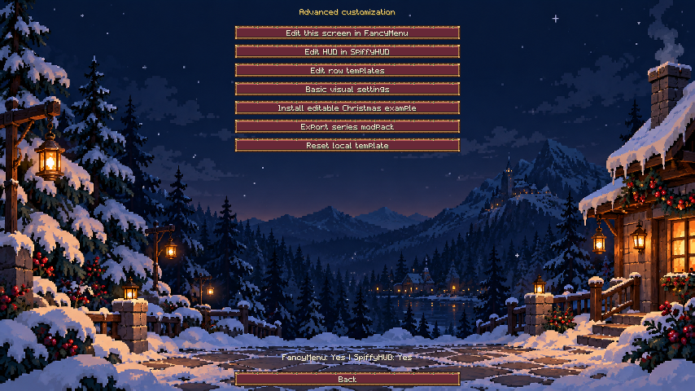
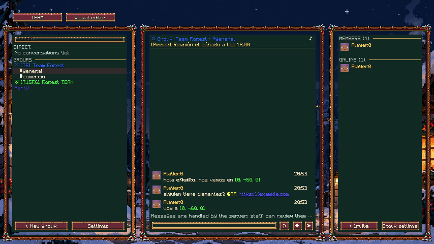
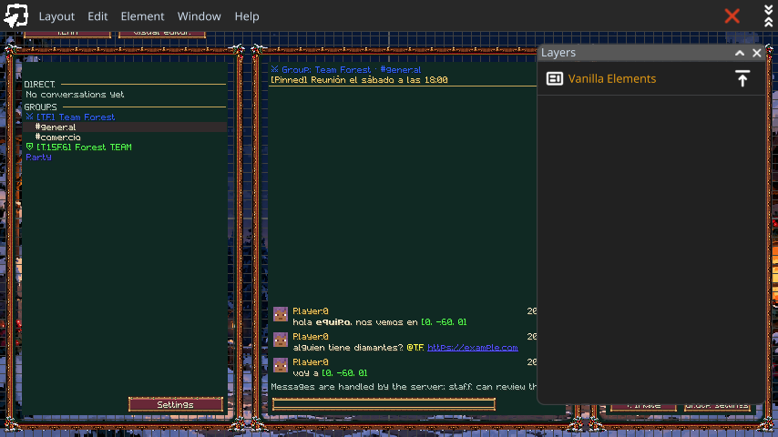
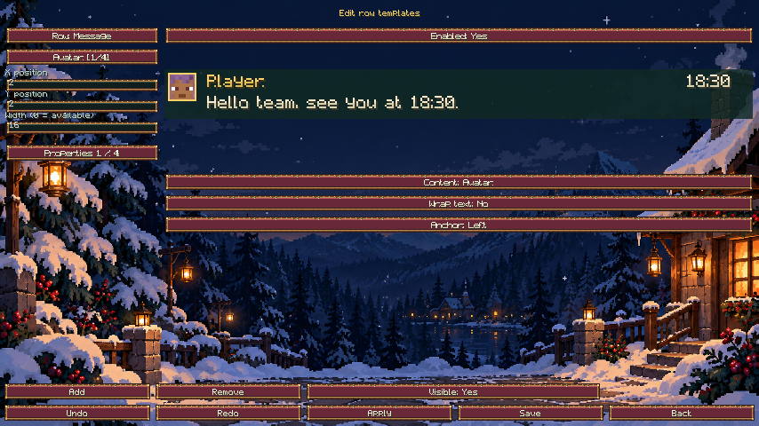
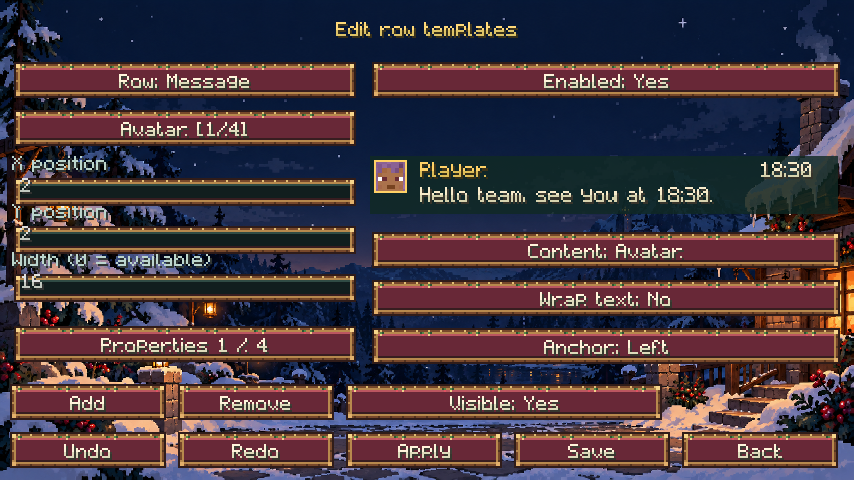
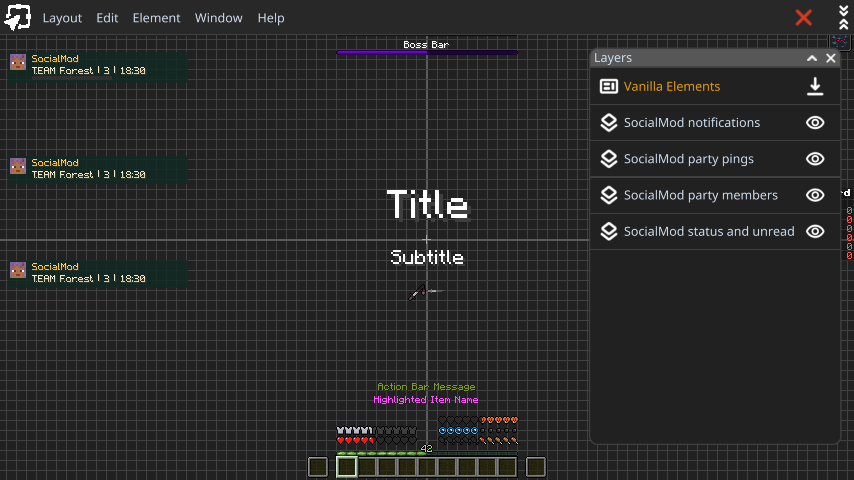
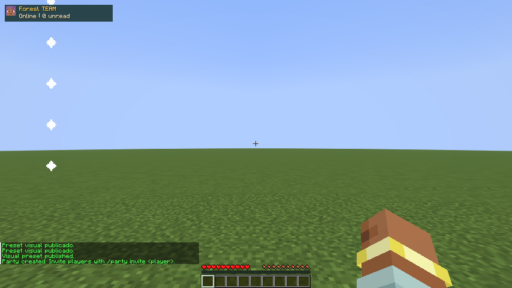

# Christmas: Winter Lodge

Editable template for **SocialMod 0.4.0**, FancyMenu and SpiffyHUD. It includes a winter landscape, carved wood and snow frames, button states and a bitmap font supporting Spanish characters. Christmas resources are bundled in the SocialMod JAR.

Advanced customization is distributed through the **client modpack**. Messages, TEAM membership and permissions remain managed by the server.

## 1. Prepare the instance

Install SocialMod and Fabric API on the client and server. On the client, also install **FancyMenu**, its dependencies **Konkrete and Melody**, and **SpiffyHUD** to edit the HUD. Choose releases compatible with your Minecraft version.

| Minecraft | Tested FancyMenu | Tested SpiffyHUD |
| --- | --- | --- |
| 26.1.2 | 3.9.14 | 3.1.2 |
| 26.2 | 3.9.14 | 3.1.3 |
| 26.3 | 3.9.14 | 3.1.4 |

Join with `socialmod:admin.visuals` permission (OP level 2 without a permission provider). Open the panel with its assigned key and click **Visual editor**. When FancyMenu is installed, this opens **Advanced customization**.



FancyMenu's toolbar remains available in its editor. It is hidden on SocialMod screens to keep their controls accessible. The basic visual editor remains available without FancyMenu.

## 2. Install the Christmas example

Click **Install editable Christmas example**, wait for **Saved locally**, then return to the panel. This creates:

- `config/fancymenu/customization/socialmod_christmas.txt`: social screen layout.
- `config/fancymenu/customization/socialmod_christmas_hud.txt`: four HUD components when SpiffyHUD is installed.
- `config/socialmod/integration/rows.json`: message, conversation, player, party and toast templates.
- `config/socialmod/integration/visual.json`: local Christmas appearance.

Reinstalling enables existing layouts and reapplies the example's rows and appearance. Changes made to the FancyMenu layouts are preserved. Back up your files before replacing a series design.



## 3. Edit the screen in FancyMenu

Click **Edit this screen in FancyMenu** in Advanced customization. Use the **Layers** window to select the conversations, chat or players block. Move, resize or hide them; their content, clicks and scrolling follow the final bounds.

Buttons and text inputs are native controls with stable identifiers. Select them to change their position and the properties supported by FancyMenu. Use its element, background, layer and animation tools to add decorations. Save from the **Layout** menu and close using the editor's X button.



The example uses the bundled `socialmod:textures/gui/sprites/christmas/background.png` background. Store your own local images in `config/fancymenu/assets/` and use instance-relative paths. Custom row fonts and sprites can be supplied through a resource pack.

## 4. Customize repeated rows

Click **Edit row templates**. **Row** cycles through Message, Conversation, Player, Party and Toast. **Enabled** decides whether that list uses its template.



1. Select a part using its button or click it in the preview. Drag it to move it.
2. **Content** selects avatar, name, time, text, TEAM, status, unread, health, icon or role. Lists provide their relevant data; unavailable fields remain empty.
3. **Properties** cycles through four pages: position and width; height, scale and color; font, texture and row height; normal, selected and hover backgrounds.
4. Width `0` uses the available space. **Wrap text** allows multiple lines; **Anchor** switches between left and right.
5. **Add**, **Remove** and **Visible** control parts. **Undo** and **Redo** recover changes.
6. **Apply** validates fields and updates the draft. **Save** writes and activates the design on this client. **Back** closes without saving pending changes.

Apply input changes before selecting another row or part.

Colors use `#AARRGGBB`, for example `#FFFFD166` for opaque gold. Bundled font: `socialmod:christmas`. Textures use sprite identifiers such as `socialmod:christmas/button`. Resources must exist before saving.



## 5. Edit the HUD in SpiffyHUD

Click **Edit HUD with SpiffyHUD**. **Layers** contains SocialMod's **Status and unread**, **Party members**, **Party pings** and **Toasts** components. Change their position, size, visibility and other properties in the editor.



The `socialmod_row` property chooses a component's row template: `message`, `conversation`, `player`, `party` or `toast`. Defaults are Conversation for status, Message for pings, Party for members and Toast for notifications.

Each visible component replaces its native SocialMod HUD counterpart. Hiding or removing it restores that basic component. Actual data, player preferences and F1 hiding still apply.



## 6. Export and install the modpack

Click **Export series modpack**. The result is `config/socialmod/presets/socialmod-series.zip`. It includes FancyMenu and SpiffyHUD configuration, local rows and appearance, and referenced local resources inside the instance. Other FancyMenu customizations in that instance are exported too: prepare a dedicated series instance.

To install the [Christmas template](examples/christmas/christmas-modpack.zip):

1. Close Minecraft and back up existing configuration.
2. Extract the ZIP into the instance root, merging its `config/` directories with the modpack.
3. Include compatible SocialMod, FancyMenu, Konkrete, Melody and SpiffyHUD releases.
4. Distribute and activate any custom resource packs separately. The bundled example uses SocialMod's own resources.
5. Start the game, join the server and check the panel and HUD.

This ZIP is installed through the instance folders, not the basic editor's **Import** button. It contains no mods and does not send layouts from the server. Export rejects external resources, dynamic paths and oversized packs. Keep local images inside the instance using relative paths.

**Reset local template** disables the two Christmas layouts, disables custom rows and returns to the server's basic appearance. Layouts are kept for later editing; the local appearance is saved as `visual.json.disabled`.

## Identifiers and dynamic data

| Element | Identifier |
| --- | --- |
| Social screen | `socialmod_social` |
| Conversations | `socialmod_block_conversations` |
| Chat | `socialmod_block_chat` |
| Players | `socialmod_block_players` |
| Secondary screen content | `socialmod_screen_content` |
| Buttons | `socialmod_button_<translation key>` |
| Text inputs | `socialmod_input_<translation key>` |
| TEAM button | `socialmod_team_<id>` |

Other screens: `socialmod_team`, `socialmod_teammanagement`, `socialmod_settings`, `socialmod_profile`, `socialmod_creategroup`, `socialmod_groupsettings`, `socialmod_invite`, `socialmod_quickreply`, `socialmod_tagstyle`, `socialmod_advancedcustomization` and `socialmod_rowtemplate`.

FancyMenu text can use these placeholders without additional values:

```json
{"placeholder":"socialmod_team"}
{"placeholder":"socialmod_conversation"}
{"placeholder":"socialmod_unread"}
{"placeholder":"socialmod_status"}
```

They provide the full TEAM name, active conversation, total unread count and status identifier. They return empty text when disconnected from SocialMod.

The integration follows FancyMenu's official [element](https://github.com/Keksuccino/FancyMenu-Dev-Docs/wiki/Elements) and [placeholder](https://github.com/Keksuccino/FancyMenu-Dev-Docs/wiki/Placeholders) registries. General editor instructions are available in the [FancyMenu documentation](https://docs.fancymenu.net/).

## Resources and behavior

[Small sprites and font](../tools/GenerateChristmasAssets.java) have an editable generator. The frame and background provenance is documented in the [art direction](examples/christmas/art-direction.md). The [basic preset](examples/christmas/series.json) and its [asset ZIP](examples/christmas/christmas-preset.zip) remain available for the basic editor; they differ from the advanced modpack.

The assigned panel key also closes it, including remapped bindings. Escape remains available. Appearance changes do not change TEAM membership or server permissions.

Creado por **TakumiStudios**.
