# Navidad: Refugio de invierno

Template editable para **SocialMod 0.5.0**, FancyMenu y SpiffyHUD. Incluye fondo invernal, marcos de madera y nieve, botones con estados y una fuente bitmap con tildes, ñ, ¡ y ¿. Los recursos navideños vienen en el JAR de SocialMod.

La personalización avanzada se distribuye con el **modpack del cliente**. Los mensajes, TEAM y permisos siguen gestionados por el servidor.

## 1. Preparar la instancia

Instala SocialMod y Fabric API en cliente y servidor. En el cliente instala también **FancyMenu**, sus dependencias **Konkrete y Melody**, y **SpiffyHUD** si quieres editar el HUD. Usa versiones compatibles con tu Minecraft.

| Minecraft | FancyMenu probado | SpiffyHUD probado |
| --- | --- | --- |
| 26.1.2 | 3.9.14 | 3.1.2 |
| 26.2 | 3.9.14 | 3.1.3 |
| 26.3 | 3.9.14 | 3.1.4 |

Entra con permiso `socialmod:admin.visuals` (OP nivel 2 sin proveedor de permisos). Abre el panel con su tecla asignada y pulsa **Editor visual**. Con FancyMenu instalado se abre **Personalización avanzada**.

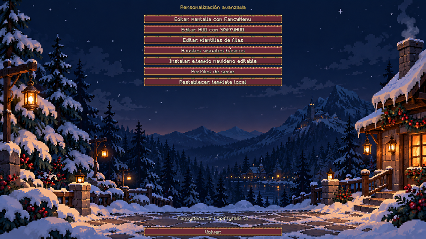

La barra de FancyMenu permanece disponible en su editor; se oculta en las pantallas de SocialMod para dejar libres sus controles. Sin FancyMenu sigue disponible el editor visual básico.

## 2. Instalar el ejemplo navideño

Pulsa **Instalar ejemplo navideño editable**. Espera a ver **Guardado en el cliente** y vuelve al panel. Se crean estos archivos:

- `config/fancymenu/customization/socialmod_christmas.txt`: diseño de la pantalla social.
- `config/fancymenu/customization/socialmod_christmas_hud.txt`: cuatro componentes de HUD, cuando SpiffyHUD está instalado.
- `config/socialmod/integration/rows.json`: plantillas de mensajes, conversaciones, jugadores, party y avisos.
- `config/socialmod/integration/visual.json`: apariencia local navideña.

Volver a instalar activa los layouts existentes y aplica de nuevo las filas y la apariencia del ejemplo. Conserva las modificaciones hechas al layout de FancyMenu. Haz una copia de tus archivos antes de sustituir un diseño de serie.

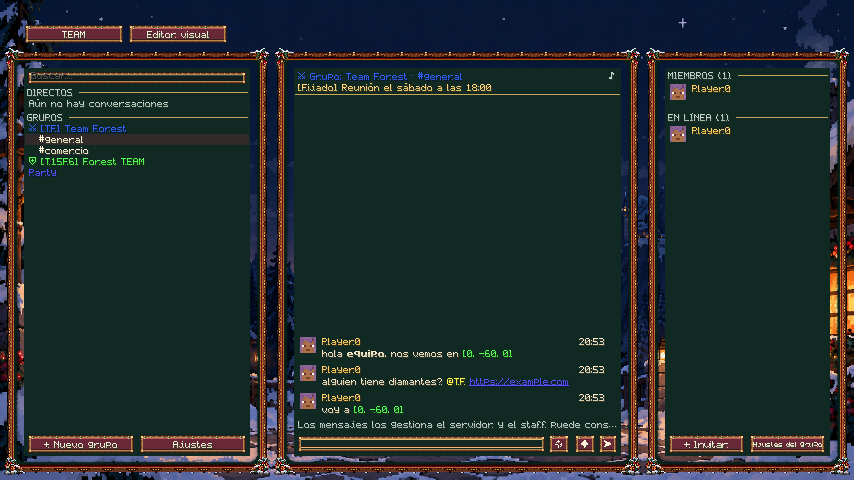

## 3. Editar la pantalla con FancyMenu

Desde Personalización avanzada pulsa **Editar pantalla con FancyMenu**. En la ventana **Layers** selecciona los bloques de conversaciones, chat o jugadores. Puedes moverlos, redimensionarlos y ocultarlos; su contenido, clics y desplazamiento usan la posición final.

Los botones y campos de texto son controles nativos con identificadores estables. Selecciónalos para cambiar su ubicación y las propiedades que ofrece FancyMenu. Utiliza sus herramientas de elementos, fondos, capas y animaciones para añadir decoraciones. Guarda desde el menú **Layout** y cierra con la X del editor.

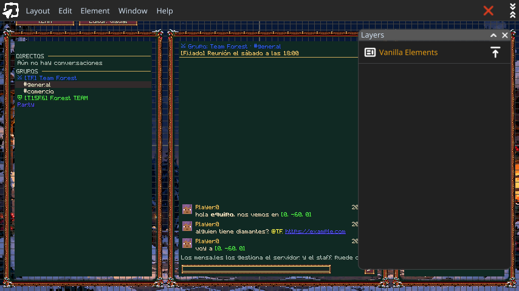

El ejemplo usa `socialmod:textures/gui/sprites/christmas/background.png` como fondo incluido en el mod. Para imágenes propias, guárdalas dentro de `config/fancymenu/assets/` y utiliza rutas relativas a la instancia. Las fuentes y sprites de las filas pueden aportarse mediante un resource pack.

## 4. Personalizar cada fila

Pulsa **Editar plantillas de filas**. **Fila** alterna entre Mensaje, Conversación, Jugador, Party y Aviso. **Activada** decide si esa lista utiliza su template.

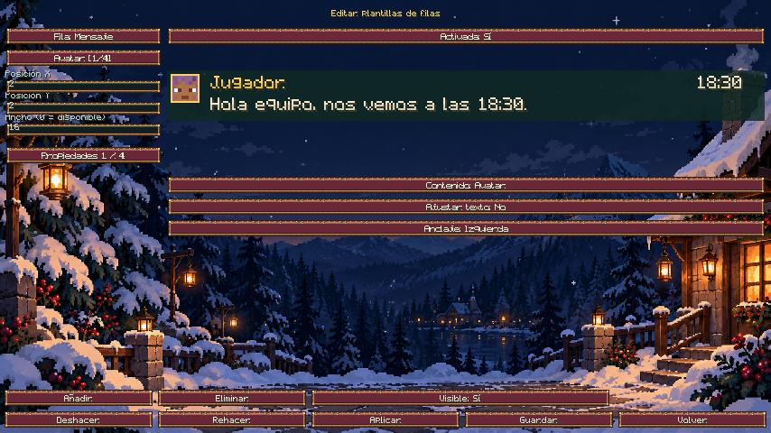

1. Selecciona una parte con su botón o pulsa sobre ella en la vista previa. Arrástrala para moverla.
2. **Contenido** cambia el campo: avatar, nombre, hora, texto, TEAM, estado, no leídos, vida, icono o rol. Cada lista muestra los campos de sus datos; un campo sin datos queda vacío.
3. Usa **Propiedades** para recorrer las cuatro páginas: posición y ancho; altura, escala y color; fuente, textura y altura de fila; fondos normal, seleccionado y hover.
4. Un ancho de `0` utiliza el espacio disponible. **Ajustar texto** permite varias líneas; **Anclaje** cambia entre izquierda y derecha.
5. **Añadir**, **Eliminar** y **Visible** controlan las partes. **Deshacer** y **Rehacer** recuperan cambios.
6. **Aplicar** valida los campos y actualiza el borrador. **Guardar** lo escribe en el cliente y activa el diseño. **Volver** cierra sin guardar los cambios pendientes.

Aplica los cambios de los campos antes de seleccionar otra fila o parte.

Colores: `#AARRGGBB`, por ejemplo `#FFFFD166` para dorado opaco. Fuente incluida: `socialmod:christmas`. Las texturas se indican como sprites, por ejemplo `socialmod:christmas/button`. Los recursos deben existir antes de guardar.

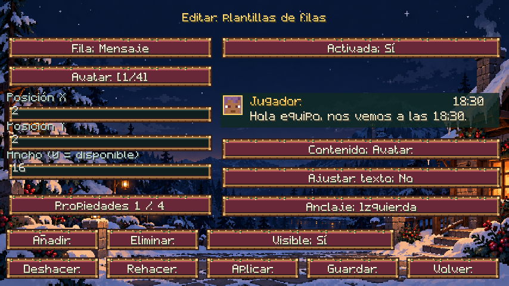

## 5. Editar el HUD con SpiffyHUD

Pulsa **Editar HUD con SpiffyHUD**. En **Layers** encontrarás los componentes **Estado y no leídos**, **Miembros de party**, **Pings de party** y **Avisos de SocialMod**. Cambia su posición, tamaño, visibilidad y demás propiedades desde el editor.

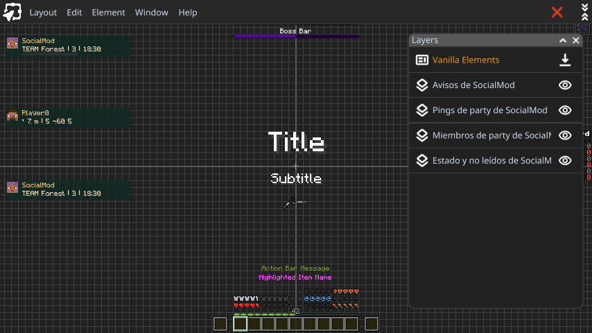

La propiedad `socialmod_row` elige la plantilla de filas que dibuja cada componente. Sus valores son `message`, `conversation`, `player`, `party` y `toast`. Por defecto, estado usa Conversación; pings, Mensaje; miembros, Party; avisos, Aviso.

Cada componente visible sustituye su HUD nativo de SocialMod. Ocultarlo o quitarlo devuelve ese componente al HUD básico. Se mantienen los datos reales, las preferencias del jugador y la ocultación con F1.

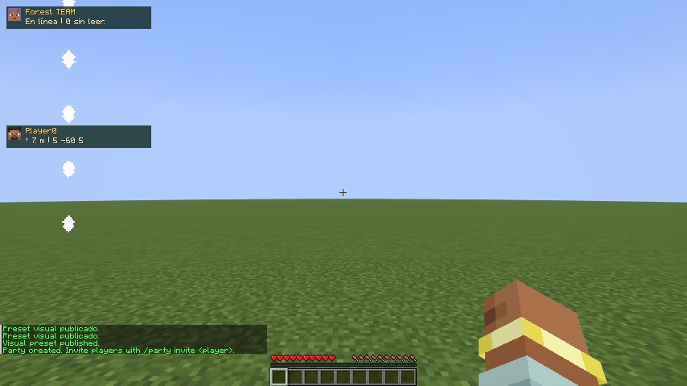

## 6. Guardar perfiles y exportar la serie

Pulsa **Perfiles de serie**. El botón **Página** alterna entre Perfiles, Archivos y exportación, e Importar y restaurar.

En **Perfiles**, selecciona **Nuevo perfil**, escribe nombre, autor y versión del diseño. En **Archivos y exportación**, recorre los layouts con el primer botón y decide **Incluir layout: Sí/No**. Por defecto se seleccionan los archivos cuyo nombre empieza por `socialmod_`. Puedes añadir layouts propios con otros nombres. Las filas y la apariencia local se incluyen si existen.

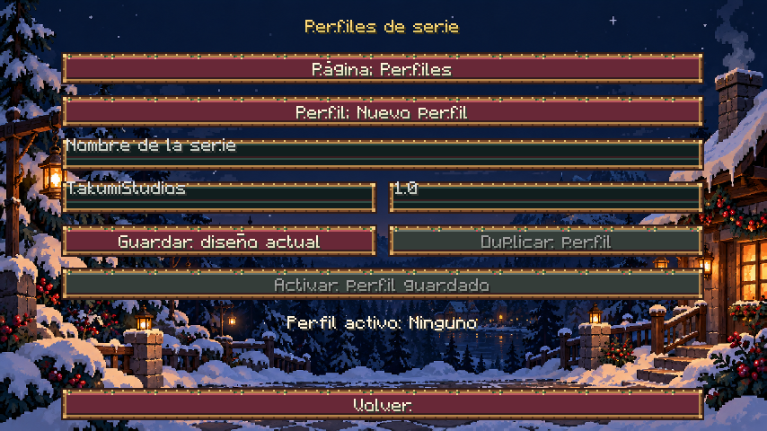

Vuelve a **Perfiles** y pulsa **Guardar diseño actual**. Se guarda una instantánea del diseño del cliente en `config/socialmod/series/profiles/`, sin activarla. Para actualizarla, selecciona el perfil y vuelve a guardar. **Duplicar perfil** crea una copia independiente de la instantánea guardada; **Activar perfil guardado** instala esa instantánea con respaldo del diseño anterior. Los cambios posteriores en los editores solo se incorporan al perfil cuando vuelves a guardarlo.

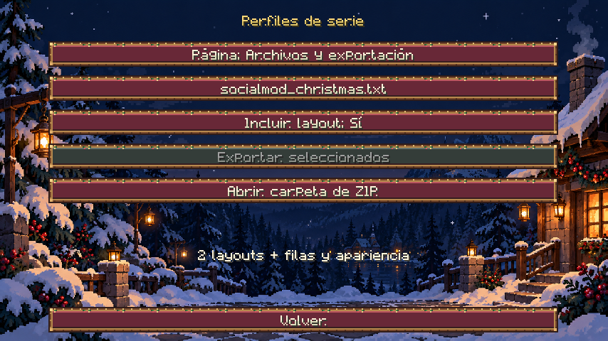

En **Archivos y exportación**, pulsa **Exportar seleccionados**. El ZIP queda en `config/socialmod/presets/socialmod-series.zip`. Contiene únicamente los layouts seleccionados, sus recursos locales referenciados, las filas, la apariencia y un manifiesto `socialmod-series.json` con nombre, autor, versión, Minecraft y mods necesarios. No incluye preferencias de FancyMenu ni otros layouts. Las imágenes propias deben estar dentro de `config/fancymenu/assets/`, `config/spiffyhud/assets/` o `config/socialmod/assets/`. Los resource packs personalizados se distribuyen y activan por separado.

## 7. Importar con revisión y respaldo

Descarga el template de tu versión: [26.1.2](examples/christmas/christmas-modpack-26.1.2.zip), [26.2](examples/christmas/christmas-modpack-26.2.zip) o [26.3](examples/christmas/christmas-modpack.zip).

1. Pulsa **Abrir carpeta de ZIP** y coloca el archivo en `config/socialmod/presets/`.
2. En **Importar y restaurar**, pulsa **Actualizar lista de ZIP**, selecciona el archivo y pulsa **Revisar ZIP**.
3. Revisa nombre, autor, versión, dependencias y archivos. Instala los mods compatibles y activa los resource packs necesarios antes de importar. Si falta un mod, una fuente o textura de las filas, o no coincide Minecraft, la instalación queda bloqueada.
4. Pulsa **Instalar con respaldo**. Se guarda como nuevo perfil y se activa; los editores se recargan sin reiniciar Minecraft.
5. Comprueba el panel y el HUD. **Restaurar diseño anterior** recupera los archivos afectados antes de la última activación y elimina los que esa activación creó. El respaldo persiste al reiniciar; una nueva activación sustituye el respaldo anterior.

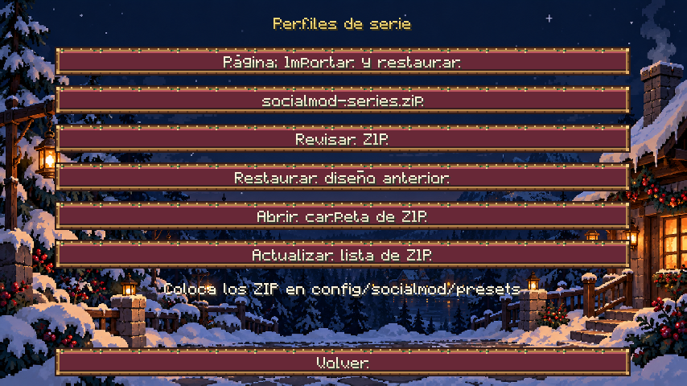

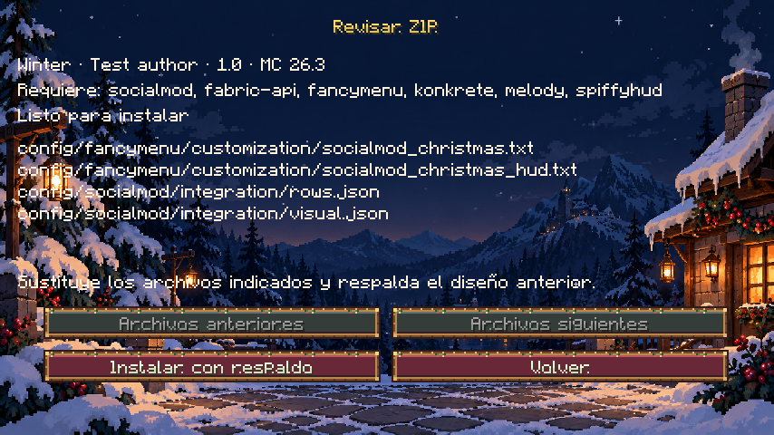

Cambiar de perfil retira los layouts creados por el perfil anterior y desactiva los que ya existían; los recursos previos se recuperan. Si el nuevo perfil no incluye filas o apariencia local, se vuelve a la presentación básica. Conserva los layouts ajenos que no se hayan seleccionado. La revisión muestra los archivos que serán sustituidos; evita seleccionar un layout compartido con otras personalizaciones si no quieres modificarlo.

No se usa el botón **Importar** del editor básico para este ZIP. Los ZIP avanzados anteriores a 0.5.0 carecen de manifiesto: vuelve a exportarlos con la versión actual, o instálalos manualmente con Minecraft cerrado. El ZIP no contiene mods ni envía layouts desde el servidor. El importador rechaza rutas externas, archivos ajenos al diseño, enlaces simbólicos, modelos inválidos y paquetes demasiado grandes.

**Restablecer template local** desactiva los dos layouts navideños, desactiva las filas personalizadas y vuelve a la apariencia básica del servidor. Conserva los layouts para poder editarlos más adelante; la apariencia local se guarda como `visual.json.disabled`.

## Identificadores y datos dinámicos

| Elemento | Identificador |
| --- | --- |
| Pantalla social | `socialmod_social` |
| Conversaciones | `socialmod_block_conversations` |
| Chat | `socialmod_block_chat` |
| Jugadores | `socialmod_block_players` |
| Contenido de pantallas secundarias | `socialmod_screen_content` |
| Botones | `socialmod_button_<clave de traducción>` |
| Campos de texto | `socialmod_input_<clave de traducción>` |
| Botón de TEAM | `socialmod_team_<id>` |

Otras pantallas: `socialmod_team`, `socialmod_teammanagement`, `socialmod_settings`, `socialmod_profile`, `socialmod_creategroup`, `socialmod_groupsettings`, `socialmod_invite`, `socialmod_quickreply`, `socialmod_tagstyle`, `socialmod_advancedcustomization` y `socialmod_rowtemplate`.

En los textos de FancyMenu puedes insertar estos placeholders, sin valores adicionales:

```json
{"placeholder":"socialmod_team"}
{"placeholder":"socialmod_conversation"}
{"placeholder":"socialmod_unread"}
{"placeholder":"socialmod_status"}
```

Representan el nombre completo del TEAM, la conversación activa, el total sin leer y el identificador de estado. Sin conexión a SocialMod devuelven texto vacío.

Para desarrollar la integración se siguen los registros oficiales de [elementos](https://github.com/Keksuccino/FancyMenu-Dev-Docs/wiki/Elements) y [placeholders](https://github.com/Keksuccino/FancyMenu-Dev-Docs/wiki/Placeholders). Las instrucciones generales del editor están en la [documentación de FancyMenu](https://docs.fancymenu.net/).

## Recursos y comportamiento

Los [sprites y la fuente](../tools/GenerateChristmasAssets.java) tienen un generador editable. El origen del marco y del fondo está documentado en [la dirección de arte](examples/christmas/art-direction.md). El [preset básico](examples/christmas/series.json) y su [ZIP con recursos](examples/christmas/christmas-preset.zip) siguen disponibles para el editor básico; son distintos del modpack avanzado.

La tecla asignada al panel también lo cierra, incluso al reasignarla. Escape sigue disponible. Cambiar el diseño no cambia la pertenencia a TEAM ni los permisos de servidor.

Creado por **TakumiStudios**.
