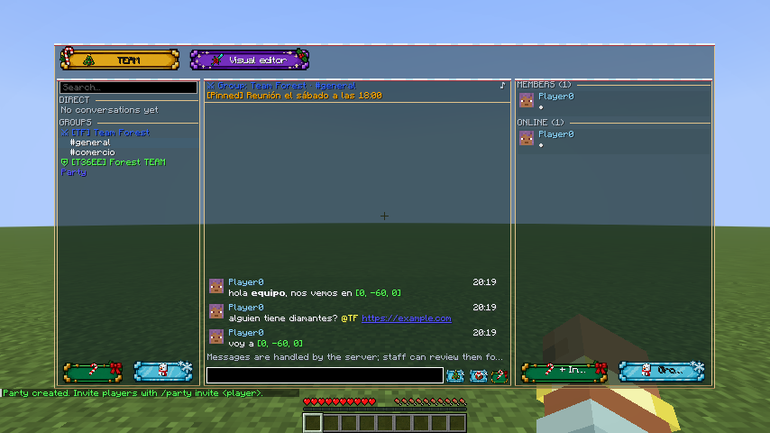
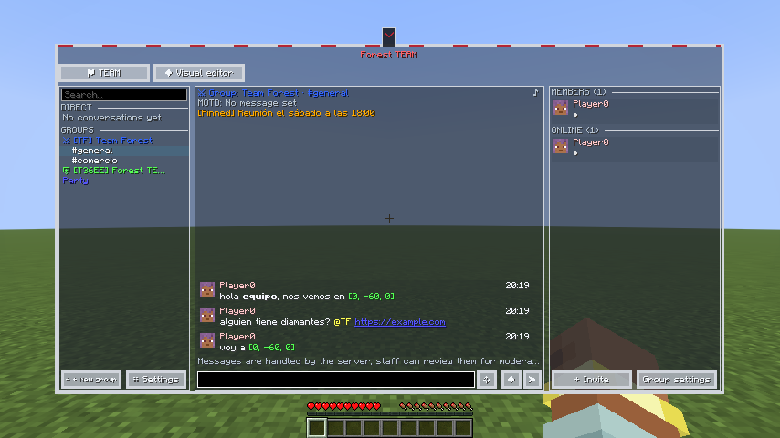
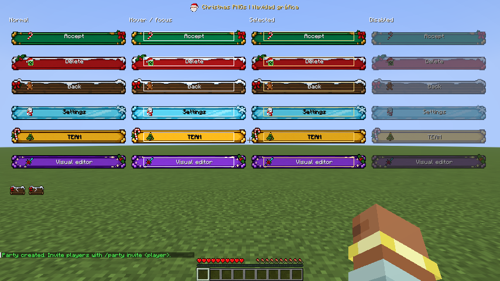
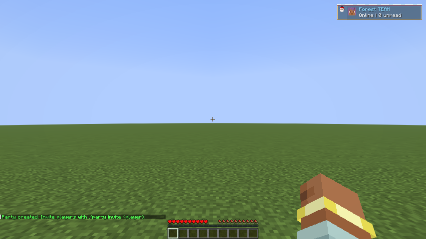

# Christmas graphic and Dedsafio: keep the game visible

> Historical 0.6.0 guide. Since 0.7.0, profiles are managed by FancyMenu; see the [current customization guide](personalizacion-0.7.0.md).

SocialMod 0.6.0 provides two editable **FancyMenu + SpiffyHUD** examples. Christmas uses the exact supplied PNGs: snow, holly and bow button panels, plus Minecraft pixel-art icons. Dedsafio retains its grey frame and red details.

Both use **no full-screen background image, blur or dimming**. Chat and lists remain translucent; buttons keep their original illustrated surfaces.

## 1. Choose a design

| Design | Screen | HUD |
| --- | --- | --- |
| **Christmas graphic** | Six button families, snow trim and festive icons. TEAM, settings and customization share the style. | Compact status, notifications, party and pings with editable border and icon. |
| **Dedsafio 4 inspired** | Grey frame, red accents, TEAM heading, MOTD above chat and real player avatars. | Compact panels with red accents. |

Small windows use tabs. Narrow buttons display an icon with a tooltip while preserving keyboard access and narration. Player colors and avatars remain real data.

## 2. Install the mods

Install **SocialMod 0.6.0 and Fabric API** on client and server. They use **protocol 4**: update both together. Incompatible clients retain commands.

On the client, add **FancyMenu, Konkrete and Melody**. Add **SpiffyHUD** to edit the HUD.

| Minecraft | Tested FancyMenu | Tested SpiffyHUD |
| --- | --- | --- |
| 26.1.2 | 3.9.14 | 3.1.2 |
| 26.2 | 3.9.14 | 3.1.3 |
| 26.3 | 3.9.14 | 3.1.4 |

The manifest records exact versions; import review checks dependencies. Editor access requires `socialmod:admin.visuals` (`socialmod.admin.visuals` with LuckPerms), or OP level 2 without a permissions provider.

## 3. Install a design in game

1. Open the social panel and choose **Visual editor → Advanced customization**.
2. Use Design to select **Christmas graphic** or **Dedsafio 4 inspired**.
3. Click **Install design with backup** and wait for completion.
4. Return to the panel. This changes your client appearance; it does not publish changes to the server.
5. Use **Restore previous design** to recover the last configuration. The next installation replaces that backup.

Layouts live at `config/fancymenu/customization/socialmod_<style>.txt` and `_hud.txt`; rows and appearance live in `config/socialmod/integration/`. Current style IDs are `christmas` and `dedsafio`.

Activating an example disables the other built-in examples while retaining their edited files and a backup. Existing clean profiles and old Christmas resources remain compatible. **Save edits as a profile before reinstalling the original example.**

## 4. The six original buttons

| Variant | Default purpose | Icon |
| --- | --- | --- |
| Green | Confirm, accept, invite, create and send | Candy cane |
| Red | Delete, deny, leave, block and report | Christmas creeper |
| Wood | Navigation and general actions | Gingerbread |
| Ice | Settings, edit, copy and sharing | Snowman |
| Gold | TEAM | Christmas tree |
| Purple | Visual editor, templates and profiles | Decorated sword |

Santa and the crafting-table gift are also included. PNGs are unchanged: rendering stretches the center while preserving decorated ends. Main panel controls are 32 pixels high.

Hover and focus brighten buttons, pressing dims them, selection adds a gold marker and disabled controls are muted. **High contrast** replaces artwork with plain readable controls.

## 5. Customize with FancyMenu

1. Open **Edit screen with FancyMenu**, then **Layers**.
2. Select a control by its stable identifier. Move, resize, hide it or change its normal, hover and disabled textures. Clicking follows the resulting bounds.
3. Original button images are copied to `config/fancymenu/assets/socialmod/christmas_graphic/buttons/`; icons are in `icons/`.
4. Replace a PNG there, keeping its filename and transparency, to change the whole variant. Reload FancyMenu or reactivate the profile. To change one control, assign another image in its layout.
5. Keep labels as game text for translation, tooltips and narration; do not paint labels into the PNG.

`socialmod_block_conversations`, `socialmod_block_chat` and `socialmod_block_players` allow moving or resizing the real social lists and chat. Avoid adding a full-screen background element if you want the world visible.

TEAM, settings and customization screens use the same festive family and local image copies. Include their saved layouts when exporting.

## 6. Rows and HUD

**Edit rows** supports conversation, message, player, party and toast fields: position, dimensions, color, wrapping, font and texture. Apply before saving a profile. Invalid values block selection changes and retain your draft; undo keeps up to 40 steps.

With SpiffyHUD, open **Edit HUD**. SocialMod elements show real status, notifications, party and pings. Move, resize, hide them or select their row type. Christmas adds **Festive border** and **Christmas icon**. Available names: `tree`, `candy`, `santa`, `snowman`, `gingerbread`, `creeper`, `sword`, `crafting_gift`.

Without SpiffyHUD, installing from the game retains the native HUD. A failed custom component restores its native counterpart.

## 7. Profiles, exports and ZIPs

1. Open **Series profiles** and select layouts to save.
2. **Save current design** creates a snapshot. Save again after editing; profiles do not update automatically. Duplicate preserves the original.
3. **Export selected** writes `config/socialmod/presets/socialmod-series.zip`. Copy or rename the previous export first.
4. Place import ZIPs in that folder, refresh the list and choose **Review ZIP**. Check Minecraft, versions, author and files.
5. Install with backup, then verify screen and HUD. Older manifests without version requirements show a warning.

| Minecraft | Christmas graphic | Dedsafio |
| --- | --- | --- |
| 26.1.2 | [ZIP](examples/series/christmas-26.1.2.zip) | [ZIP](examples/series/dedsafio-26.1.2.zip) |
| 26.2 | [ZIP](examples/series/christmas-26.2.zip) | [ZIP](examples/series/dedsafio-26.2.zip) |
| 26.3 | [ZIP](examples/series/christmas-26.3.zip) | [ZIP](examples/series/dedsafio-26.3.zip) |

These ZIPs require SpiffyHUD and contain no mods. Without SpiffyHUD, install from the game. Christmas includes six button images, eight standalone icons, layouts, rows, appearance and manifest. Exporting a Christmas profile retains the whole image family even after FancyMenu reserializes a layout.

Additional resources must live in `config/fancymenu/assets/`, `config/spiffyhud/assets/` or `config/socialmod/assets/`. Import rejects external paths, symbolic links and oversized packs. Resource packs are distributed separately.

## 8. Troubleshooting

| Symptom | Check |
| --- | --- |
| Advanced customization is missing | Install FancyMenu and its client dependencies. |
| The world is hidden | Use a new example and remove backgrounds added by other layouts. |
| Some controls show icons only | Hover for the tooltip or increase their width. |
| Edited PNG has not changed | Reload FancyMenu; check for a per-control texture override. |
| Install is disabled | Check versions and resources listed in review. |
| A field is invalid | Fix its number, range, color or resource before changing selection. |
| HUD is duplicated | Disable other HUD layouts you added manually. |
| Profile differs from your edits | Save another snapshot after editing. |
| There is no backup | Complete an installation with backup first. |
| Panel is recovering synchronization | Wait for the fresh snapshot; reduce server limits if state exceeds 8 MiB. |

Creado por **TakumiStudios**.
