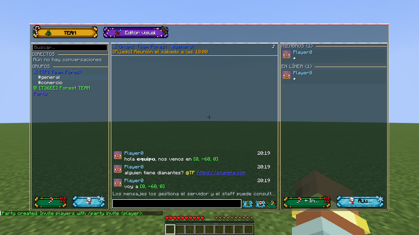
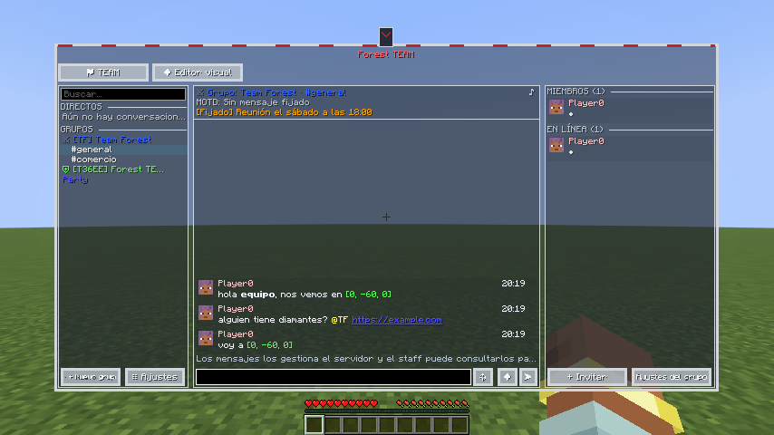
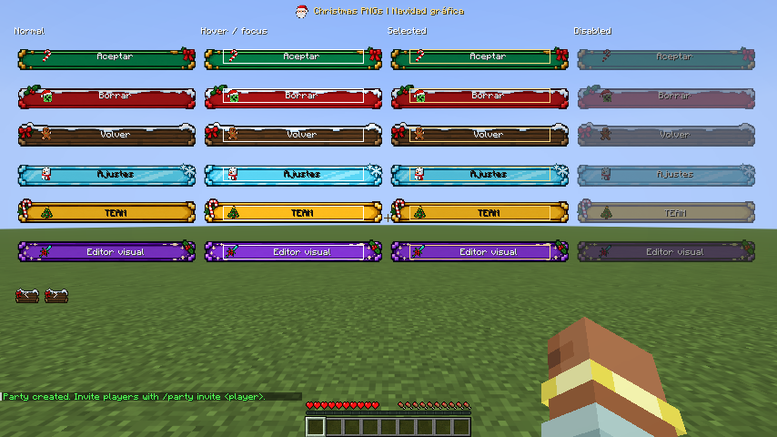
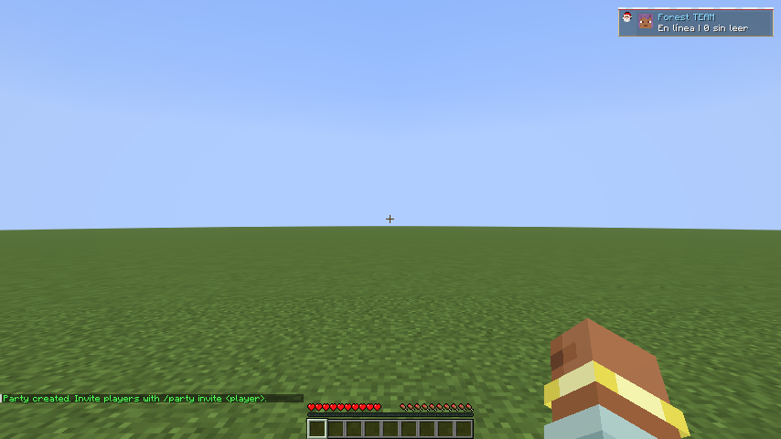

# Navidad gráfica y Dedsafío: el juego siempre visible

SocialMod 0.6.0 incluye dos diseños editables con **FancyMenu** y **SpiffyHUD**. Navidad usa los PNG originales proporcionados: botones de nieve, acebo y lazos, más iconos pixel art de Minecraft. Dedsafío conserva su marco gris y sus detalles rojos.

Ambos dejan visible el mundo: **sin imagen de fondo global, desenfoque ni oscurecimiento de pantalla**. El chat y las listas usan superficies semitransparentes. Los botones sí conservan sus superficies gráficas originales.

## 1. Elegir el diseño

| Diseño | Pantalla | HUD |
| --- | --- | --- |
| **Navidad gráfica** | Seis familias de botones, bordes de nieve, cabeceras e iconos navideños. TEAM, ajustes y personalización comparten la estética. | Estado, avisos, party y pings compactos, con borde e icono editables. |
| **Inspirado en Dedsafío 4** | Marco gris con detalles rojos, TEAM, MOTD encima del chat y miembros con avatares reales. | Distribución compacta con acentos rojos. |

En ventanas pequeñas se usan pestañas. Los botones estrechos muestran un icono con tooltip; las etiquetas siguen disponibles para narración y teclado. Los colores y avatares de jugadores siguen siendo datos reales.

## 2. Preparar cliente y servidor

Instala **SocialMod 0.6.0 y Fabric API** en cliente y servidor. Usan el **protocolo 4**: actualiza ambos juntos. Los clientes incompatibles conservan los comandos.

En el cliente instala **FancyMenu, Konkrete y Melody**. Añade **SpiffyHUD** para editar el HUD.

| Minecraft | FancyMenu probado | SpiffyHUD probado |
| --- | --- | --- |
| 26.1.2 | 3.9.14 | 3.1.2 |
| 26.2 | 3.9.14 | 3.1.3 |
| 26.3 | 3.9.14 | 3.1.4 |

El manifiesto de cada ZIP incluye las versiones exactas; el importador comprueba las dependencias. Para acceder al editor se requiere `socialmod:admin.visuals` (`socialmod.admin.visuals` con LuckPerms); sin proveedor de permisos, OP nivel 2.

## 3. Instalar desde el juego

1. Abre el panel y pulsa **Editor visual → Personalización avanzada**.
2. Selecciona **Navidad gráfica** o **Inspirado en Dedsafío 4** con el botón Diseño.
3. Pulsa **Instalar diseño con respaldo** y espera a que termine.
4. Vuelve al panel. La apariencia se instala en tu cliente; no publica cambios en el servidor.
5. Usa **Restaurar diseño anterior** para recuperar la última configuración. La siguiente instalación sustituye ese respaldo.

Los layouts son `config/fancymenu/customization/socialmod_<estilo>.txt` y `_hud.txt`. Las filas y apariencia están en `config/socialmod/integration/`. Los estilos actuales son `christmas` y `dedsafio`.

Al activar un ejemplo se desactivan los otros ejemplos incluidos, conservando sus archivos editados y el respaldo. Los perfiles previos de Social limpio y los recursos navideños antiguos siguen siendo compatibles. **Guarda tus modificaciones como perfil antes de reinstalar el ejemplo original.**

## 4. Los seis botones originales

| Variante | Uso predeterminado | Icono |
| --- | --- | --- |
| Verde | Confirmar, aceptar, invitar, crear y enviar | Bastón de caramelo |
| Rojo | Eliminar, rechazar, salir, bloquear y reportar | Creeper navideño |
| Madera | Navegación y acciones generales | Galleta de jengibre |
| Hielo | Ajustes, edición, copiar y compartir | Muñeco de nieve |
| Dorado | TEAM | Árbol de Navidad |
| Morado | Editor visual, plantillas y perfiles | Espada con lazo |

También se incluyen Papá Noel y la mesa de crafteo con regalo. Los PNG se conservan exactamente; el render adapta el centro del botón y mantiene la proporción de sus extremos decorados. Los controles principales del panel miden 32 píxeles de alto.

Hover y foco aumentan el brillo, la pulsación atenúa el botón, la selección añade una marca dorada y los controles deshabilitados se ven apagados. **Alto contraste** sustituye las imágenes por controles sencillos legibles.

## 5. Editar con FancyMenu

1. Pulsa **Editar pantalla con FancyMenu** y abre **Layers**.
2. Selecciona el control por su identificador estable. Puedes moverlo, cambiar tamaño, ocultarlo y editar sus imágenes de reposo, hover o deshabilitado. Los clics siguen su posición y tamaño.
3. Cambia el fondo o icono del botón en las opciones de textura. Las imágenes originales se instalan en `config/fancymenu/assets/socialmod/christmas_graphic/buttons/` y `icons/`.
4. Para cambiar toda una variante, reemplaza su PNG en esa carpeta conservando el nombre y la transparencia. Recarga FancyMenu o reactiva el perfil para cargarlo. Para cambiar un solo botón, asígnale otra imagen en su layout.
5. Mantén las etiquetas como texto del juego para conservar traducción, tooltip y narración. Evita escribirlas dentro del PNG.

Los bloques `socialmod_block_conversations`, `socialmod_block_chat` y `socialmod_block_players` permiten mover o redimensionar las listas y el chat. Sus datos siguen viniendo de SocialMod. No añadas un elemento de fondo de pantalla si quieres seguir viendo el mundo.

Las pantallas de TEAM, ajustes y personalización también usan la familia navideña y las copias locales. Los layouts guardados para esas pantallas se pueden seleccionar al exportar.

## 6. Filas y HUD

En **Editar filas** elige conversación, mensaje, jugador, party o toast. Cambia campos, posición, tamaño, color, ajuste de texto, fuente y textura. Aplica antes de guardar el perfil. Un valor inválido bloquea el cambio de selección y conserva el borrador; deshacer mantiene hasta 40 pasos.

Con SpiffyHUD, pulsa **Editar HUD**. Los elementos SocialMod muestran datos reales de estado, avisos, party y pings. Puedes moverlos, redimensionarlos, ocultarlos y elegir su tipo de fila. Navidad añade **Borde navideño** e **Icono navideño**; nombres disponibles: `tree`, `candy`, `santa`, `snowman`, `gingerbread`, `creeper`, `sword`, `crafting_gift`.

Sin SpiffyHUD, la instalación desde el juego conserva el HUD nativo. Si falla un componente personalizado, su equivalente nativo vuelve a mostrarse.

## 7. Perfiles, exportación y ZIP

1. Abre **Perfiles de serie** y selecciona los layouts que deseas guardar.
2. **Guardar diseño actual** crea una instantánea. Guarda de nuevo tras editar; un perfil no se actualiza automáticamente. Duplicar conserva el original.
3. **Exportar seleccionados** crea `config/socialmod/presets/socialmod-series.zip`. Copia o renombra el anterior antes de exportar otra vez.
4. Para importar, coloca el ZIP en esa carpeta, actualiza la lista y pulsa **Revisar ZIP**. Comprueba Minecraft, versiones, autor y archivos.
5. Instala con respaldo y revisa pantalla y HUD. Los manifiestos antiguos sin versiones muestran una advertencia.

| Minecraft | Navidad gráfica | Dedsafío |
| --- | --- | --- |
| 26.1.2 | [ZIP](examples/series/christmas-26.1.2.zip) | [ZIP](examples/series/dedsafio-26.1.2.zip) |
| 26.2 | [ZIP](examples/series/christmas-26.2.zip) | [ZIP](examples/series/dedsafio-26.2.zip) |
| 26.3 | [ZIP](examples/series/christmas-26.3.zip) | [ZIP](examples/series/dedsafio-26.3.zip) |

Estos ZIP requieren SpiffyHUD y no incluyen mods. Sin SpiffyHUD, instala desde el juego. El paquete Navidad incluye las seis imágenes de botones y los ocho iconos individuales, además de layouts, filas, apariencia y manifiesto. Exportar un perfil navideño conserva la familia completa aunque FancyMenu reescriba el layout.

Los recursos adicionales deben estar en `config/fancymenu/assets/`, `config/spiffyhud/assets/` o `config/socialmod/assets/`. El importador rechaza rutas externas, enlaces simbólicos y paquetes que superan sus límites. Los resource packs se distribuyen por separado.

## 8. Resolver problemas

| Síntoma | Qué comprobar |
| --- | --- |
| No aparece Personalización avanzada | Instala FancyMenu y sus dependencias en el cliente. |
| No se ve el mundo | Usa un diseño nuevo y revisa que otros layouts no añadan un fondo. |
| Solo veo iconos en algunos botones | Son controles estrechos: pasa el cursor para leer su tooltip o aumenta su ancho. |
| No cambia un PNG editado | Recarga FancyMenu; revisa si ese control tiene una imagen individual que sustituye a la variante. |
| Instalar está bloqueado | Revisa versiones y recursos indicados en la revisión. |
| Un campo es inválido | Corrige su número, rango, color o recurso antes de cambiar de selección. |
| El HUD se duplica | Desactiva otros layouts de HUD que hayas añadido manualmente. |
| El perfil no coincide con tus cambios | Guarda una nueva instantánea tras editar. |
| No hay respaldo | Debe haberse completado una instalación con respaldo. |
| El panel recupera la sincronización | Espera la nueva instantánea. Si el estado supera 8 MiB, reduce los límites del servidor. |

Creado por **TakumiStudios**.
